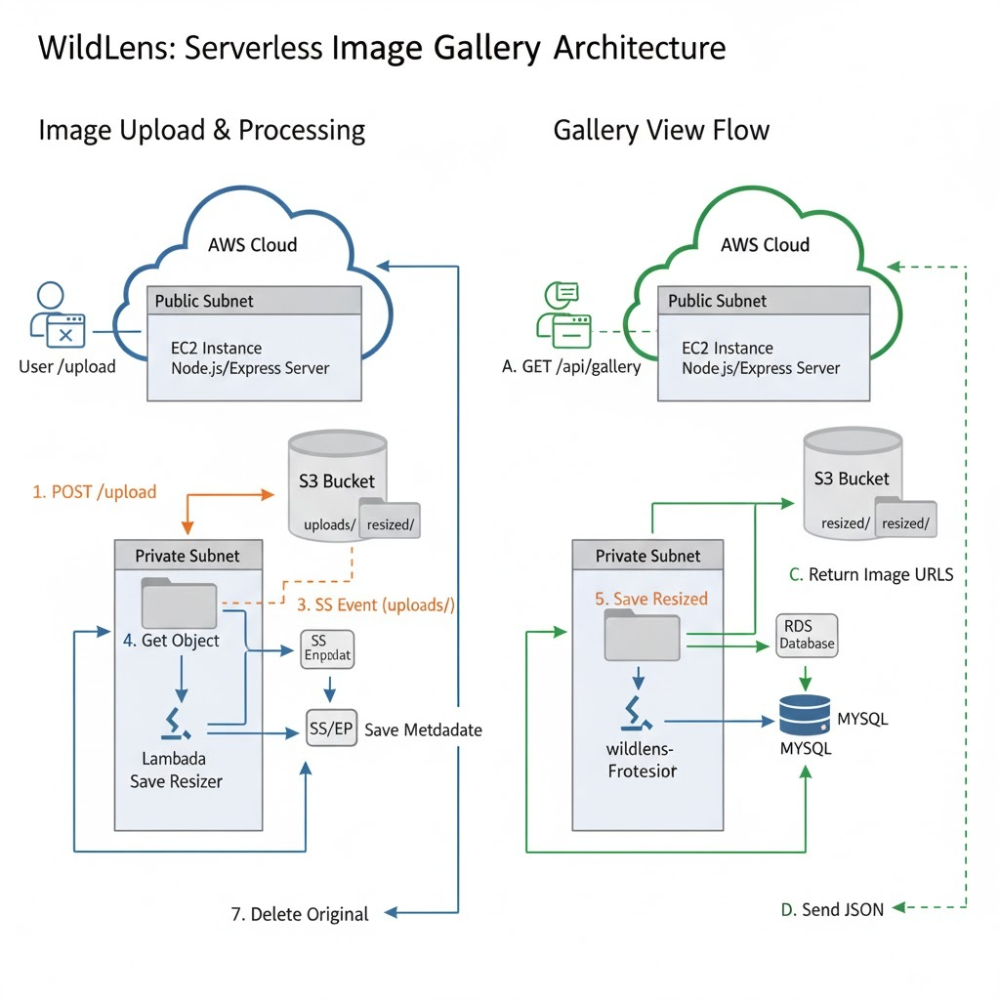

# 🦁 WildLens — A Serverless, Full-Stack Image Gallery

**WildLens** is a dynamic, cloud-native web application serving as a portfolio for wildlife photography.  
It features a **scalable, event-driven architecture** that automatically processes, resizes, and optimizes uploaded images in real-time using AWS services.

> 🧩 Built with **AWS Lambda**, **S3**, **RDS**, **EC2**, and **Node.js**, this project demonstrates a modern full-stack, serverless workflow for user-generated content.


# 🚀 Architecture



---

## 🏗️ Architecture Overview

When a user uploads an image, the EC2 backend uploads it to **S3 → uploads/**.  
This triggers a **Lambda function**, which:

1. Retrieves the image from `uploads/`
2. Resizes it using **sharp** to a 1920px-wide JPEG
3. Uploads the resized image to `resized/`
4. Inserts metadata and URLs into the **RDS (MySQL)** database
5. Deletes the original image from `uploads/` to save storage

---

### 🖼️ Architecture Diagram

*(Add your architecture image here if available)*

---

## ✨ Features

- 🖥️ **Single-Page App (SPA)** — Built with Vanilla JS & Tailwind CSS  
- 📸 **Dynamic Gallery** — Images fetched directly from RDS  
- 📤 **Drag-and-Drop Uploads**  
- ⚙️ **Serverless Processing** with AWS Lambda + Sharp  
- 🗄️ **Auto Database Entry** (Lambda → RDS)  
- ☁️ **Scalable & Event-Driven**  
- 💰 **Cost-Optimized** — Deletes full-res originals after processing

---

## 🧰 Tech Stack

| Layer | Technology |
|-------|-------------|
| **Frontend** | HTML5, Tailwind CSS, Vanilla JavaScript (ESM) |
| **Backend** | Node.js, Express.js |
| **Database** | AWS RDS (MySQL) |
| **Storage** | AWS S3 |
| **Serverless Compute** | AWS Lambda |
| **Hosting** | AWS EC2 |
| **Networking** | AWS VPC, Security Groups, S3 Gateway Endpoint |

---

## 📂 Recommended Project Structure

```
wildlens/
├── backend/
│   ├── server.js          # EC2 web server
│   ├── database.sql       # Database schema + sample data
│   ├── package.json
│   └── .env.example       # Environment variable template
├── frontend/
│   └── index.html         # SPA frontend
└── lambda/
    └── index.js           # AWS Lambda image processor
```

---

## ⚙️ Configuration & Environment Variables

### 🧾 EC2 Server (`/backend/.env`)

```env
# --- AWS RDS Credentials ---
DB_HOST=wildlens-db.xxxxxxxx.us-east-1.rds.amazonaws.com
DB_USER=admin
DB_PASSWORD=your-rds-password
DB_NAME=wildlens

# --- AWS Credentials ---
AWS_REGION=us-east-1
AWS_ACCESS_KEY_ID=YOUR_AWS_ACCESS_KEY
AWS_SECRET_ACCESS_KEY=YOUR_AWS_SECRET_KEY
AWS_BUCKET_NAME=wildlens-gallery-images
```

> 💡 **Tip:** Use an **IAM Role** on EC2 instead of embedding access keys.

---

### 🧩 Lambda Environment Variables

```env
DB_HOST=wildlens-db.xxxxxxxx.us-east-1.rds.amazonaws.com
DB_USER=admin
DB_PASSWORD=your-rds-password
DB_NAME=wildlens
```

---

## 🚀 Deployment Guide

Follow these steps to deploy WildLens from scratch on AWS.

---

### 🪴 Step 1 — Create the Database (AWS RDS)

```bash
# 1. Go to AWS Console → RDS → Create database
# 2. Choose "MySQL" & "Free tier"
# 3. Set:
#     DB instance ID: wildlens-db
#     Username: admin
#     Password: your-rds-password
#     Public access: Yes (for demo simplicity)

# 4. Get your DB Endpoint, e.g.:
# wildlens-db.xxxxxxxx.us-east-1.rds.amazonaws.com

# 5. Connect using MySQL CLI or Workbench:
mysql -h wildlens-db.xxxxxxxx.us-east-1.rds.amazonaws.com -u admin -p

# 6. Run the database setup script
source backend/database.sql;
```

---

### 🪶 Step 2 — Create the Storage Bucket (AWS S3)

```bash
# 1. Go to AWS Console → S3 → Create bucket
#    Name: wildlens-gallery-images
#    Region: us-east-1
#    Uncheck: "Block all public access"
```

**Bucket Policy:**
```json
{
  "Version": "2012-10-17",
  "Statement": [
    {
      "Effect": "Allow",
      "Principal": "*",
      "Action": "s3:GetObject",
      "Resource": "arn:aws:s3:::YOUR-BUCKET-NAME/*"
    }
  ]
}
```

```bash
# 2. Create folders
uploads/
resized/

# 3. Upload initial gallery images
wild1.jpg ... wild40.jpg
```

---

### ⚡ Step 3 — Create the Image Processor (AWS Lambda)

```bash
# Create sharp + mysql2 layer
mkdir sharp-layer && cd sharp-layer
mkdir nodejs && cd nodejs
npm init -y
npm install sharp mysql2
cd ..
zip -r sharp-mysql-layer.zip .
```

Then in AWS Lambda:

1. Create **Layer** → Upload `sharp-mysql-layer.zip`
2. Create function → Name: `wildlens-image-processor`
3. Runtime: Node.js 20.x
4. Paste `lambda/index.js` code
5. Add environment variables
6. Attach layer
7. Increase **Memory (512 MB)** & **Timeout (30s)**

**Attach IAM Policies:**
- `AmazonS3FullAccess`
- `AWSLambdaVPCAccessExecutionRole`
- `AmazonRDSDataFullAccess`

---

### 🌐 Step 4 — Networking & Triggers

**S3 Trigger → Lambda:**

```bash
# In S3 → Properties → Event notifications:
Prefix: uploads/
Event type: s3:ObjectCreated:Put
Destination: wildlens-image-processor
```

**Create S3 Gateway Endpoint (for VPC Lambda):**

```bash
# In AWS VPC → Endpoints:
Service: com.amazonaws.us-east-1.s3
Type: Gateway
VPC: Default VPC
Attach to main route table
```

**Security Groups:**
- Allow **Lambda SG → RDS (Port 3306)**
- Allow **EC2 SG → RDS (Port 3306)**

---

### 🖥️ Step 5 — Deploy the Server (AWS EC2)

```bash
# Launch Ubuntu 22.04 instance (t2.micro)
# Security Group:
#   - SSH (22) from My IP
#   - TCP (3000) from Anywhere
```

**SSH into EC2:**
```bash
chmod 400 your-key.pem
ssh -i your-key.pem ubuntu@YOUR_EC2_PUBLIC_IP
```

**Install Node.js, Git & PM2:**
```bash
curl -fsSL https://deb.nodesource.com/setup_18.x | sudo -E bash -
sudo apt-get install -y nodejs git
sudo npm install -g pm2
```

**Clone & Run the Project:**
```bash
git clone https://github.com/abrarsyedd/wildlens.git
cd wildlens/backend
npm install

# Create environment file
nano .env
# (Paste env vars, then save & exit)

# Start the server
pm2 start server.js
```

---

### ✅ Step 6 — Access Your App

Open your browser and visit:

```
http://YOUR_EC2_PUBLIC_IP:3000
```

🎉 You should now see your **WildLens Gallery** live!

---

## 🧾 License

This project is licensed under the **MIT License** — see the [LICENSE](LICENSE) file for details.

---

## 💡 Author

**Abrar Syed**  
🌐 [GitHub](https://github.com/abrarsyedd)
